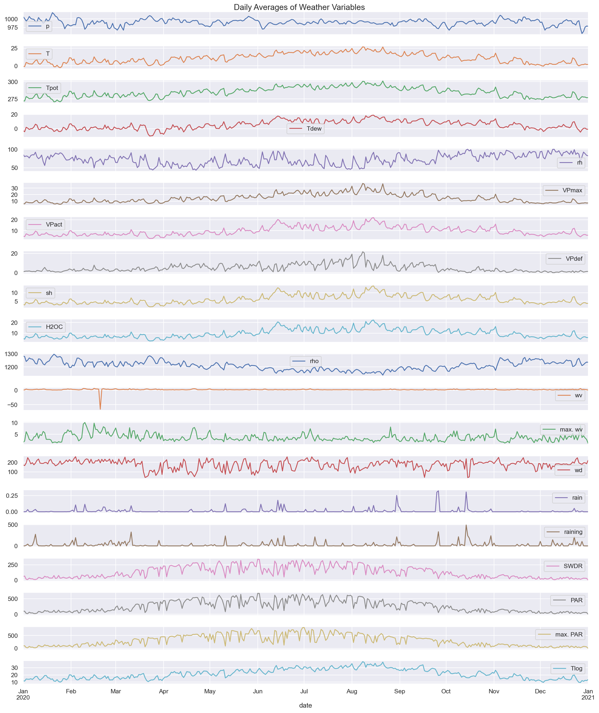
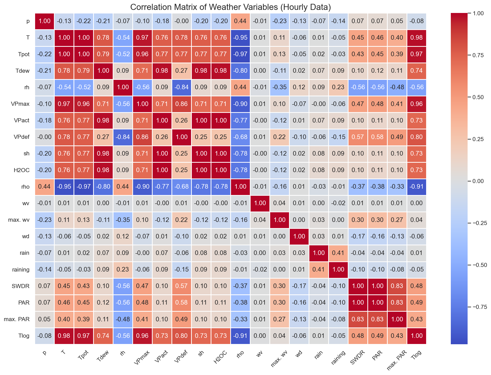
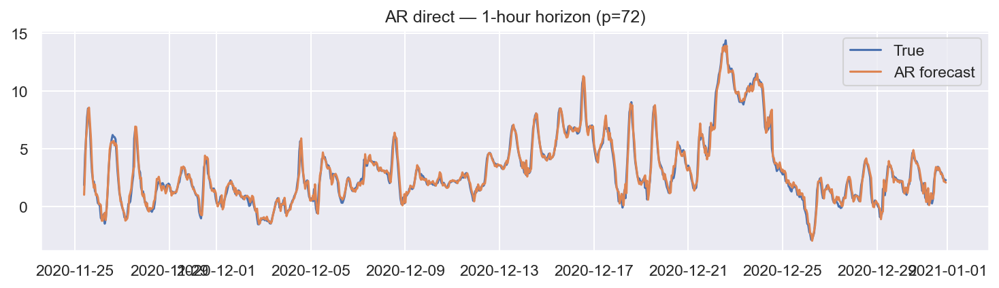

# Weather Time-Series Forecasting

This project implements a complete time-series forecasting workflow for meteorological measurements. It includes exploratory data analysis, preprocessing, and a comparison of classical and deep-learning forecasting models across multiple forecasting horizons.

The main target variable is air temperature (`T`). The implemented models are evaluated for **1-hour**, **6-hour**, and **24-hour** forecasting horizons using error metrics such as RMSE, MAE, MAPE, robust MAPE, SMAPE, and WMAPE.

---

## Project Overview

The workflow includes:

- Loading and inspecting a cleaned weather time-series dataset
- Datetime indexing and time-based resampling
- Exploratory data analysis of weather variables
- Correlation analysis and ACF/PACF diagnostics
- Temperature forecasting with an autoregressive baseline
- Deep-learning forecasting with Vanilla RNN, Attention RNN, and Transformer models
- Hyperparameter tuning with Optuna for the neural models
- Evaluation across short-term and longer-term forecasting horizons
- Generation of plots and comparison tables

---

## Repository Structure

```text
weather-time-series-forecasting/
│
├── README.md
├── requirements.txt
├── .gitignore
│
├── src/
│   ├── main.py
│   ├── part1_exploratory_preprocessing.py
│   ├── part2_ar_baseline.py
│   ├── part3_vanilla_rnn.py
│   ├── part4_attention_rnn.py
│   └── part5_transformer.py
│
├── data/
│   └── README.md
│
├── plots/
│   ├── part1/
│   ├── part2/
│   ├── part3/
│   ├── part4/
│   └── part5/
│
├── results/
│   ├── comparison_compact.csv
│   └── comparison_full.csv
│
└── docs/
    └── weather_forecasting_report.pdf
```

The dataset file is intentionally excluded from the repository. See `data/README.md` for download and placement instructions.

---

## Dataset

The project uses the **Weather Long-term Time Series Forecasting** dataset from Kaggle:

```text
https://www.kaggle.com/datasets/alistairking/weather-long-term-time-series-forecasting
```

The dataset contains meteorological measurements from 2020, including variables such as:

- atmospheric pressure
- air temperature
- potential temperature
- dew point temperature
- relative humidity
- vapor pressure variables
- wind speed and wind direction
- rain-related variables
- radiation variables

The original measurements are sampled at 10-minute intervals. In this project, the data are processed and resampled for forecasting experiments, with temperature (`T`) used as the main prediction target.

To run the project locally, place the cleaned dataset file here:

```text
data/cleaned_weather.csv
```

---

## Methods

### 1. Preprocessing and EDA

The preprocessing and exploratory analysis stage is implemented in:

```text
src/part1_exploratory_preprocessing.py
```

This stage:

- loads the weather dataset,
- parses the `date` column as a datetime index,
- checks the time range and missing values,
- resamples the data for daily and hourly analysis,
- applies basic cleaning and transformations,
- uses circular encoding for wind direction,
- visualizes distributions, trends, correlations, and ACF/PACF diagnostics.

### 2. Autoregressive Baseline

The autoregressive baseline is implemented in:

```text
src/part2_ar_baseline.py
```

The AR model is framed as a supervised learning problem using lagged temperature observations. Ridge regression is used as the regression model, and the model is evaluated across the selected forecasting horizons.

### 3. Vanilla RNN

The Vanilla RNN model is implemented in:

```text
src/part3_vanilla_rnn.py
```

The model uses rolling windows of past temperature values and predicts future temperature values at the selected horizons. It includes baseline training, Optuna-based hyperparameter tuning, and a refined tuning stage.

### 4. Attention RNN

The Attention RNN model is implemented in:

```text
src/part4_attention_rnn.py
```

This model uses an encoder-decoder recurrent architecture with Luong-style attention. The attention mechanism allows the decoder to focus on different parts of the input sequence during forecasting.

### 5. Transformer

The Transformer model is implemented in:

```text
src/part5_transformer.py
```

The Transformer uses self-attention and sinusoidal positional encoding to model temporal dependencies in the temperature series. It is trained separately for the 1-hour, 6-hour, and 24-hour horizons.

---

## Results Summary

The table below summarizes RMSE values from the compact comparison output. Lower values are better.

| Horizon | AR RMSE | Vanilla RNN RMSE | Attention RNN RMSE | Transformer RMSE | Best RMSE |
|---|---:|---:|---:|---:|---|
| 1-hour | 0.465 | 0.572 | 0.486 | 0.505 | AR |
| 6-hour | 1.556 | 1.682 | 1.487 | 3.044 | Attention RNN |
| 24-hour | 2.495 | 2.322 | 2.617 | 2.451 | Vanilla RNN |

Main observations:

- The AR baseline is highly competitive for the 1-hour horizon.
- The Attention RNN performs best at the 6-hour horizon.
- The Vanilla RNN achieves the lowest RMSE at the 24-hour horizon.
- The Transformer is competitive but less stable in these experiments, especially at the 6-hour horizon.
- No single model dominates across all horizons.

Full metric tables are available in:

```text
results/comparison_compact.csv
results/comparison_full.csv
```

A detailed report is available in:

```text
docs/weather_forecasting_report.pdf
```

---

## Representative Figures

### Daily Averages of Weather Variables



### Correlation Matrix



### AR Baseline Forecast Example



---

## How to Run

### 1. Clone the repository

```bash
git clone https://github.com/Gerostathos/weather-time-series-forecasting.git
cd weather-time-series-forecasting
```

### 2. Create and activate a virtual environment

```bash
python -m venv .venv
```

Windows:

```bash
.venv\Scripts\activate
```

macOS / Linux:

```bash
source .venv/bin/activate
```

### 3. Install dependencies

```bash
pip install -r requirements.txt
```

### 4. Add the dataset locally

Download the dataset from Kaggle and place the cleaned CSV file at:

```text
data/cleaned_weather.csv
```

The dataset itself is not committed to GitHub.

### 5. Run the full pipeline

From the repository root, run:

```bash
python src/main.py --csv data/cleaned_weather.csv --plot-dir plots --report-dir results --train-ratio 0.70 --val-ratio 0.10 --horizons 1 6 24
```

This command runs the preprocessing, AR baseline, Vanilla RNN, Attention RNN, and Transformer experiments for the selected forecasting horizons.

To run a faster single-horizon experiment, for example only the 1-hour horizon:

```bash
python src/main.py --csv data/cleaned_weather.csv --plot-dir plots --report-dir results --train-ratio 0.70 --val-ratio 0.10 --horizons 1
```

---

## Notes

- The deep-learning models use PyTorch.
- Optuna is used for automated hyperparameter tuning.
- Running all models and horizons can take time, especially without a GPU.
- The dataset is kept local and excluded from GitHub.
- Generated cache files, virtual environments, raw datasets, and unnecessary Windows files are excluded through `.gitignore`.

---

## Future Improvements

Possible extensions include:

- adding configuration files for experiment settings,
- saving trained model checkpoints in a controlled `models/` directory,
- adding a lightweight inference script,
- expanding experiments to additional weather datasets,
- improving Transformer tuning for medium-horizon forecasting,
- adding automated tests for preprocessing and window construction.
